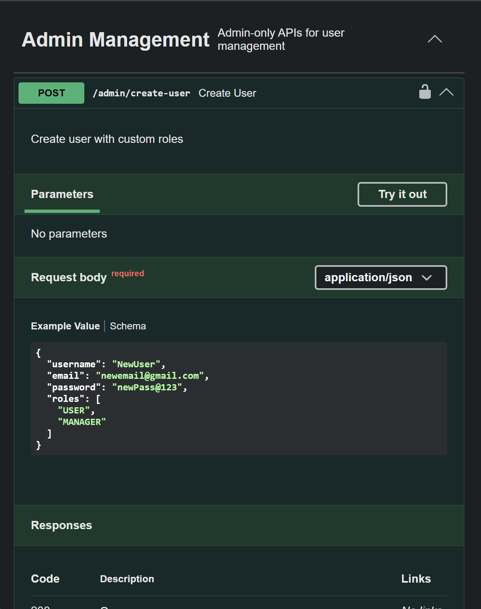

# User Management System (UMS) API 

A comprehensive RESTful web service built with **Spring Boot 3.5**, focusing on **Role-Based Access Control (RBAC)**, secure authentication, and database optimization.

## 🚀 Key Features

* **Authentication & Authorization:** Secure JWT-based authentication with Access and Refresh tokens.
* **Role-Based Access Control (RBAC):** Managed user roles (Admin, Manager, User) and permissions for secure endpoint access.
* **Data Mapping:** Integrated **MapStruct** for efficient DTO-to-Entity conversions, reducing boilerplate.
* **Database Optimization:** Resolved **N+1 select problems** using targeted queries and implemented **Database Indexing**.
* **Advanced Relationships:** Many-to-Many relationship between Users and Roles with **Auditing** support.
* **Global Exception Handling:** Centralized error management using `@ControllerAdvice` for consistent responses.
* **API Documentation:** Fully documented with **Swagger/OpenAPI 3**, including detailed schemas.

## 🛠️ Tech Stack

* **Java**: 21
* **Framework**: Spring Boot 3.5.12
* **Security**: Spring Security & JWT (jjwt 0.13.0)
* **Data Access**: Spring Data JPA
* **Database**: PostgreSQL (Production/Dev), H2 (Testing)
* **Mapping**: MapStruct 1.6.3
* **API Documentation**: SpringDoc OpenAPI 2.8.15
* **Utility**: Lombok

## 📋 Prerequisites

Before running this application, ensure you have:

* **Java 21** or higher
* **PostgreSQL** Database
* **Maven** (included via `./mvnw`)
* IDE (IntelliJ IDEA, Eclipse, or VS Code)

## ⚙️ Configuration

1. **Clone the repository:**
   ```bash
   git clone https://github.com/Rom-Visal/Spring-Boot-REST-API.git
   cd Spring-Boot-REST-API
   ```

2. **Configure Database (src/main/resources/application.properties):**
   ```properties
   spring.datasource.url=jdbc:postgresql://localhost:5432/role_base
   spring.datasource.username=your_username
   spring.datasource.password=your_password
   spring.jpa.hibernate.ddl-auto=update
   ```

3. **Environment Variables / Properties:**
   The following properties are used for JWT configuration:
   - `jwt.secret`: Base64 encoded secret key for access tokens.
   - `jwt.expiration-ms`: Access token expiration time in milliseconds.
   - `jwt.refresh-secret`: Base64 encoded secret key for refresh tokens.
   - `jwt.refresh-expiration-ms`: Refresh token expiration time in milliseconds.

## 🚀 Running the Application

### Using Maven Wrapper
```bash
# Windows
.\mvnw.cmd spring-boot:run

# Linux/macOS
./mvnw spring-boot:run
```

The application will start on [http://localhost:8080](http://localhost:8080).

## 🧪 Testing

The project includes unit and integration tests using JUnit 5 and MockMvc.

```bash
# Run all tests
.\mvnw.cmd test
```

## 📂 Project Structure

```text
src/main/java/com/example/ums/
├── api/             # API interfaces with Swagger annotations
├── config/          # Spring configuration classes
├── controller/      # REST controllers
├── dto/             # Data Transfer Objects (Requests/Responses)
├── entity/          # JPA entities
├── exception/       # Exception handling logic
├── mapper/          # MapStruct mappers
├── repository/      # Spring Data JPA repositories
├── security/        # Security configuration and JWT logic
└── service/         # Business logic layer
```

## 📖 API Documentation

Once the application is running, access the interactive Swagger UI at:

[http://localhost:8080/swagger-ui/index.html](http://localhost:8080/swagger-ui/index.html)

#### API Preview


## 📜 License

This project is licensed under the TODO: [Add License Name, e.g., MIT License] - see the [LICENSE](LICENSE) file for details. (Note: No LICENSE file found in root).

---
Developed by [Rom Visal](https://github.com/Rom-Visal)